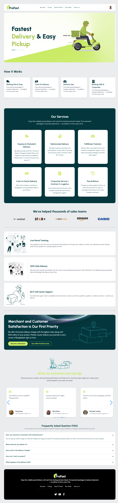
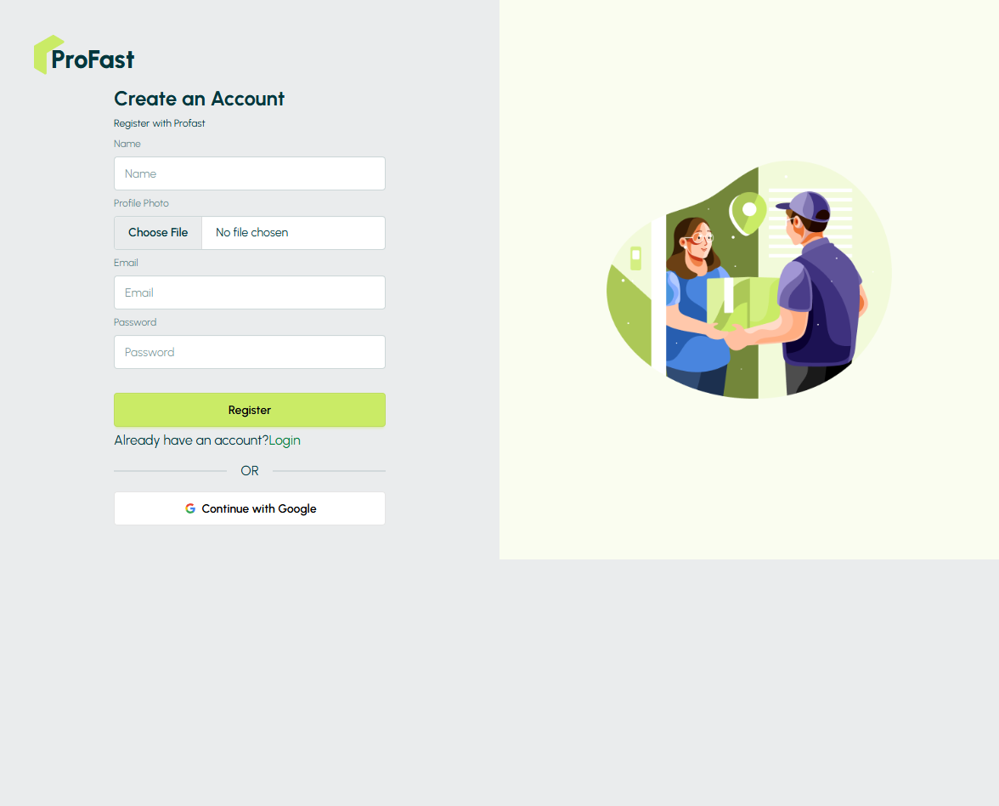
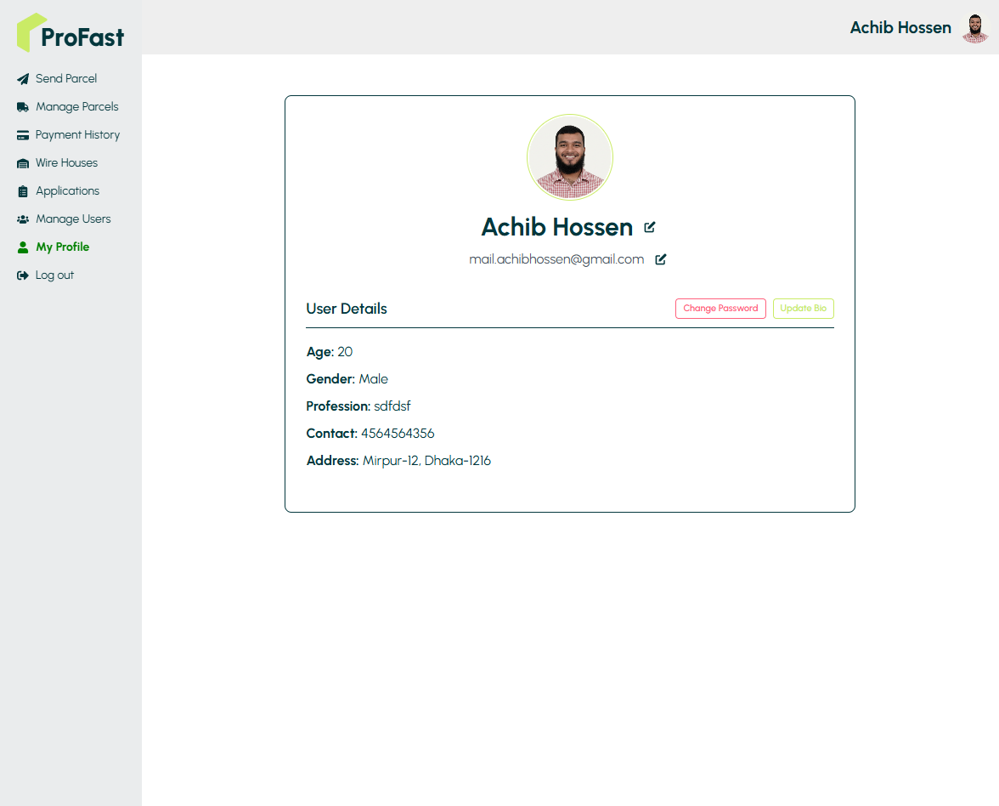
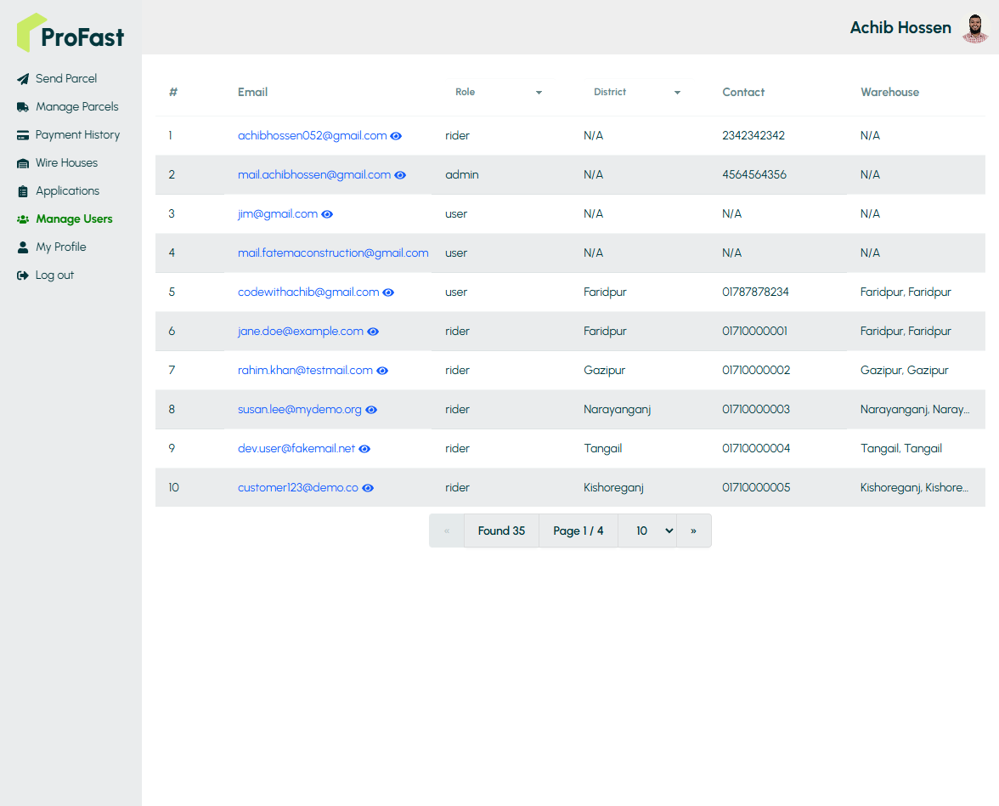
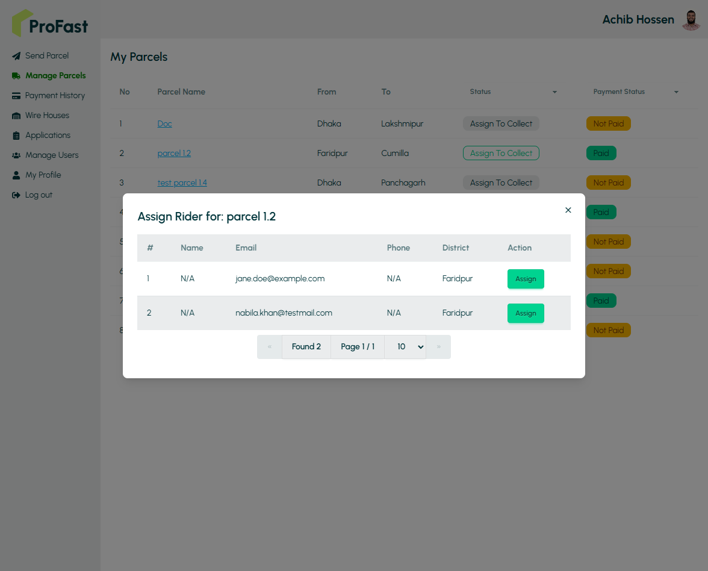
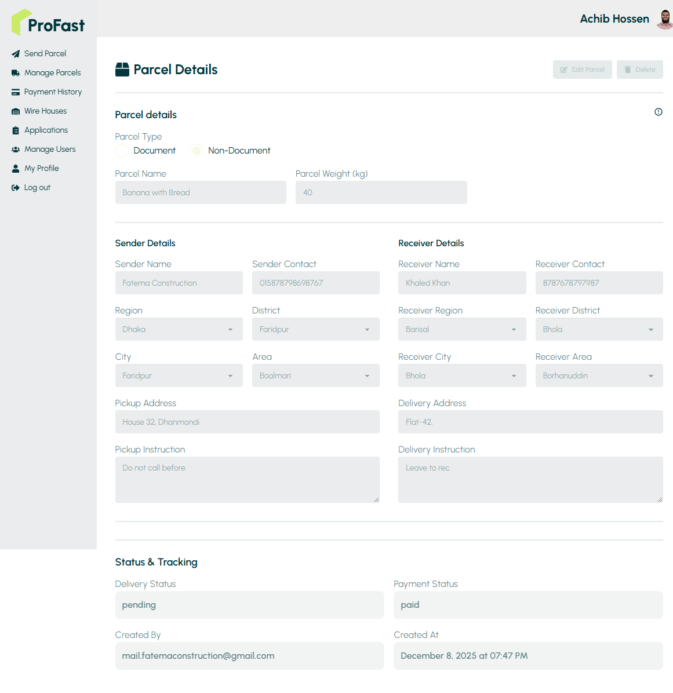
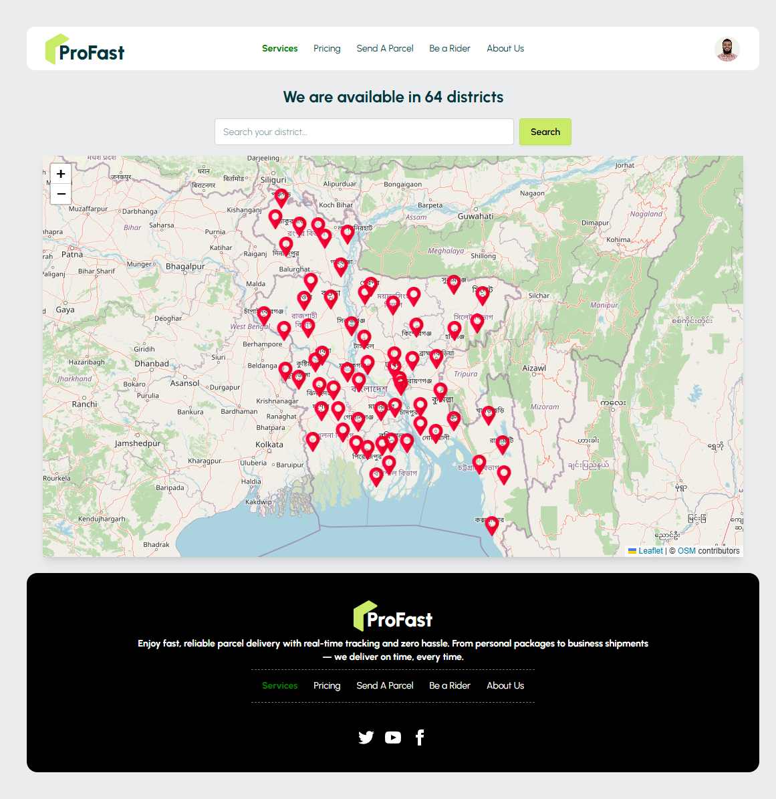

## 📦 Profast | A Parcel Delivery Service

ProFast is a full-stack parcel delivery management system where users can send parcels, track delivery status in real time, and make secure payments. Riders can earn money by delivering parcels, while admins manage users, riders, and delivery operations across Bangladesh.

## ✨ Key Features

- Parcel Management: Send, track, update, and conditionally delete parcels.
- Rider Integration: Users can apply to become riders and earn money by collecting and delivering parcels.
- Secure Payments: Stripe integration for delivery cost payments.
- Real-time Tracking: Track full delivery workflow using parcel ID.
- Coverage Map: Check available service areas across Bangladesh.
- Authentication: Firebase Authentication with Email/Password + Google Login.
- RBAC: Role-based access for Admin, Rider, and User.

## 🧑‍💻 Roles & Permissions

| Role         | Responsibilities                                                                |
| ------------ | ------------------------------------------------------------------------------- |
| **Admin**    | Manage all users, handle rider applications, assign riders, view parcel history |
| **Rider**    | View assigned parcels, update delivery statuses, view earnings                  |
| **User**     | Send parcels, make payments, view payment history                               |
| **All Role** | Update Profile, Change Password, Change Account Email                           |

## 🔗 Links & Credentials

**Live Application:** [https://profast-eae10.web.app/](https://profast-eae10.web.app/)

**Frontend Repository:** [https://github.com/achibhossengit/ProFast-Client](https://github.com/achibhossengit/ProFast-Client)

**Backend Repository:** [https://github.com/achibhossengit/ProFast-Server](https://github.com/achibhossengit/ProFast-Server)

| Role      | Email                | Password  |
| --------- | -------------------- | --------- |
| **Admin** | hellocoder@gmail.com | test@1234  |
| **Rider** | jane.doe@example.com | test@1234 |
| **User**  | hossen@example.com   | test@1234 |

## ⚙️ Workflows

### 1. Registration & Login

- Users register via Email/Password or Google.
- Firebase creates the account; MongoDB stores a user entry with role="user".
- After login, Firebase token is verified by backend to determine user role.
- Auth context stores user + role; secure API calls attach token via `useaxiosSecure`.

### 2. Rider Application

- User submits rider application.
- Stored in `riders` collection with region, district, NID, bike info.
- Admin reviews and accepts/rejects.

### 3. Parcel Delivery (Core Workflow)

#### 3.1 Send Parcel

- User creates parcel → `delivery_status='pending'`, `payment_status='unpaid'`.
- After Stripe payment → `payment_status='paid'`.

#### 3.2 Assign Rider (Admin)

- Admin assigns rider based on sender district.
- Parcel updated with `assigned_to_collect` and status → `collecting`.

#### 3.3 Rider Updates Status

- Rider collects → `collecting` → `collected`.

**Same District:**

- `collected` → `delivering` → `delivered`, assigned to same rider.

**Different District:**

- `collected` → `sendWarehouse` → Admin assigns new rider → `delivering` → `delivered`.

#### 3.4 Tracking

- User tracks parcel in real time.

## 🚀 Tech Stack

| Category       | Technology                            |
| -------------- | ------------------------------------- |
| Frontend       | React, React Router, TanStack Query   |
| Styling        | TailwindCSS, DaisyUI                  |
| Backend        | Express.js                            |
| Database       | MongoDB                               |
| Authentication | Firebase Auth, Firebase Admin         |
| Payment        | Stripe                                |
| Deployment     | Firebase (Frontend), Vercel (Backend) |

## 🛠️ Installation & Setup

### Backend (Express.js)

```bash
git clone https://github.com/achibhossengit/ProFast-Server
cd ProFast-Server
npm install
nodemon index.js
```

Add `.env` with:

```bash
DB_USER=<Your database username>
DB_PASSWORD=<Your database password>
STRIPE_SECRET_KEY=<Your Stripe secret key>
FB_SERVICE_KEY=<Your Firebase service account key
```

### Frontend

```bash
git clone https://github.com/achibhossengit/ProFast-Client
cd ProFast-Client
npm install
npm run dev
```

Add `.env` values:

```bash
VITE_FIREBASE_API_KEY=<Your Firebase API key>
VITE_FIREBASE_AUTH_DOMAIN=<Your Firebase authentication domain (required to avoid CORS issues)>
VITE_FIREBASE_PROJECT_ID=<Your Firebase project ID>
VITE_FIREBASE_STORAGE_BUCKET=<Your Firebase storage bucket>
VITE_FIREBASE_MESSAGING_SENDER_ID=<Your Firebase messaging sender ID>
VITE_FIREBASE_APP_ID=<Your Firebase application ID>

VITE_STRIPE_PUBLISHABLE_KEY=<Your Stripe publishable key>

VITE_IMGBB_API_KEY=<Your ImgBB API key>

VITE_SERVER_URL=<Your backend server URL>

```

---

## 📸 Media Showcase

### Application Screenshots

<div style="display">

#### Homepage



#### Login Page


#### Register Page



#### Profile Page



#### Manage User (Admin)



#### Manage Parcel


#### Assign Rider (Admin)



#### Parcel Details



#### Parcel Payment


#### Send Parcel


#### Coverage Map



#### Access Denied


#### Not Found


